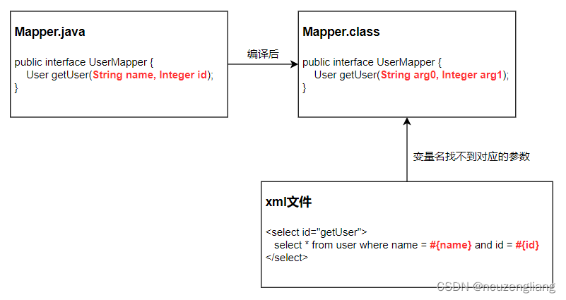
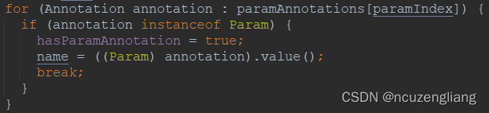
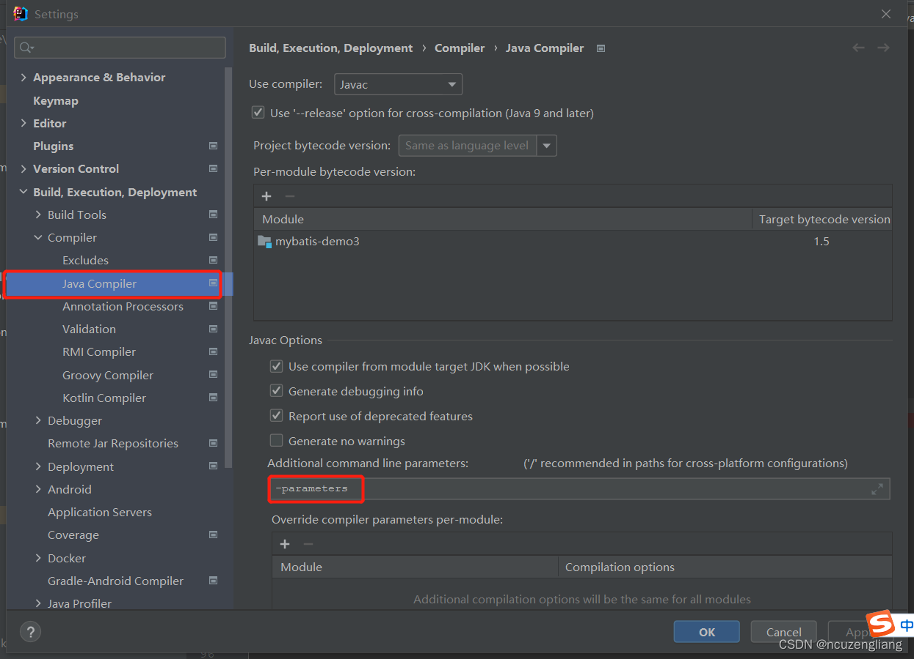
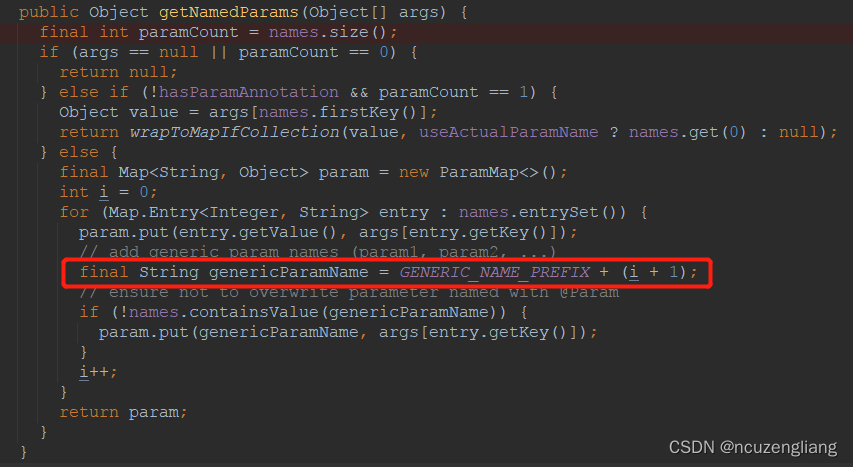
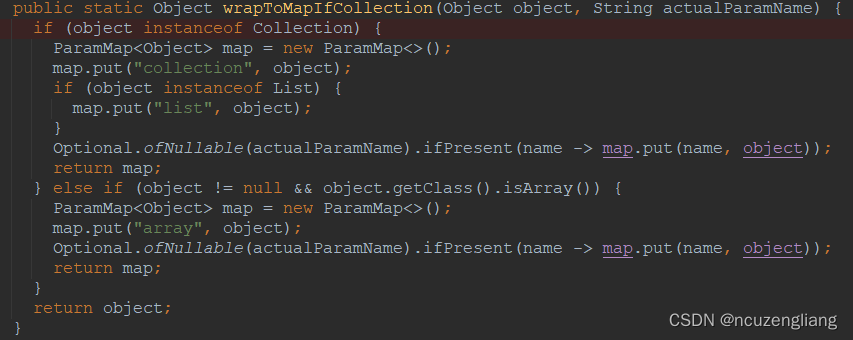

mybatis的使用过程中，经常出现如下报错：

- org.apache.ibatis.binding.BindingException: Parameter 'xxx' not found. Available parameters are [arg1, arg0, param1, param2]

大部分文章告诉你在Mapper接口的方法参数上使用@Param注解，可是有的时候不用也没有问题，还有的时候用了@Param注解也还是报错，今天我们探究下这个注解原理，以后你碰到这个问题就不再懵逼了。
<br>

# 1.问题根因

首先要了解一个背景问题，**Java在编译之后的class文件中，并不会保留参数名称，而是用arg0, arg1等名称替换**，这就导致xml文件中的变量，根本找不到对应的方法参数，这就是上面报错的原因。而后序所有的方案，本质其实都是为了解决这个问题。


# 2.Mybatis解决方案

## 2.1 @Param注解指定参数名称

因为@Param注解可以保持到运行期，所以你可以使用它指定参数名称，

```java
User getUser(@Param("id")Integer id, @Param("name")String name);
```

mybatis在解析参数名称的时候，就可以拿到参数名称。下面是Mybatis源码（`见org.apache.ibatis.reflection.ParamNameResolver#ParamNameResolver`）。

这里要注意是使用Mybatis包下的org.apache.ibatis.annotations.Param注解，而不是Spring JPA下的`org.springframework.data.repository.query.Param`注解，**这就是为什么你明明用了@Param注解，却还是会报错。**

## 2.2 保留编译后参数名称

既然问题是因为编译后，class文件中没有保留参数名称，那我们想办法保留就行，在Java8之后，javac命令加上参数 `-parameters`，编译得到的class文件将保留参数名称。

1.  idea中手动设置编译参数
    路径为：Settings -> Build, Execution, Deployment -> Compiler -> Java Compiler
    
2.  maven编译插件配置参数

```xml
<!-- 3.6.2版本之前的写法 -->
<plugin>
   <groupId>org.apache.maven.plugins</groupId>
    <artifactId>maven-compiler-plugin</artifactId>
    <version>3.6.1</version>
    <configuration>
        <compilerArgs>-parameters</compilerArgs>
    </configuration>
</plugin>

<!-- 3.6.2版本之后的写法 -->
<plugin>
   <groupId>org.apache.maven.plugins</groupId>
    <artifactId>maven-compiler-plugin</artifactId>
    <version>3.6.2</version>
    <configuration>
        <parameters>true</parameters>
    </configuration>
</plugin>
```

3.  springboot项目继承自spring-boot-starter-parent，默认已开启
    这就是为什么，你有时候不使用@Param注解也没问题的原因。

## 2.3 使用默认参数名称

如果确实拿不到源码中的那个参数名称，那我们还可以使用默认的参数名称。
除了编译之后的参数名称 `(arg0,arg1...)`，mybatis还提供了额外的名称：`(param1, param2, ...)`，所以你会发现，报错信息中Available parameters are [arg1, arg0, param1, param2]，就是这么来的。

注意，第一个参数，可以是arg0或param1，第二个参数，名称可以是arg1或param2，以此类推。

下面是Mybatis源码（`见org.apache.ibatis.reflection.ParamNameResolver#getNamedParams`）。


## 2.4 单个参数，名称随意

当方法中只有一个参数的时候，且没有使用@Param注解，mybatis也能拿到参数值，因为方法中只有一个参数值，SQL中也只有一个变量，可以不用通过参数名称去映射，所以你在SQL中，可以这么写 `#{hahaha}`，也不会有问题。
不过在源码中还发现一个有意思的地方，就是如果方法只有一个参数，mybatis还提供了一些额外的名称

- 参数类型是Collection，可用的参数名称 --> [arg0, param1, collection]
- 参数类型是List，可用的参数名称 --> [arg0, param1, collection, list]
- 参数类型是数组，可用的参数名称 --> [arg0, param1, array]

下面是Mybatis源码（`见org.apache.ibatis.reflection.ParamNameResolver#wrapToMapIfCollection`）。

这也是为啥你不用@Param注解指定参数名称，也没有问题。

# 3.最佳实践

1.SQL中尽量不使用#{arg0}, #{param}, #{collection},#{list}, #{array} 这些默认的参数名称，而应该保持和方法参数名称一致2.尽量使用@Param注解标记参数名称3.当方法只有一个参数时，可以不用写@Param注解4.也可以直接使用编译参数-parameters，编译后保留参数名称

# 4.总结

@Param注解解决的就是java编译之后，方法参数名称丢失的问题，因为注解中的信息是会保留到运行期，这样Mybatis中的SQL参数变量就可以准确进行赋值。
