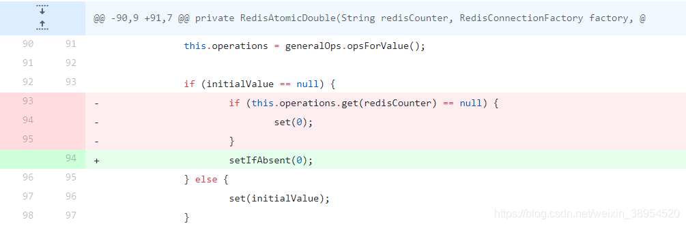
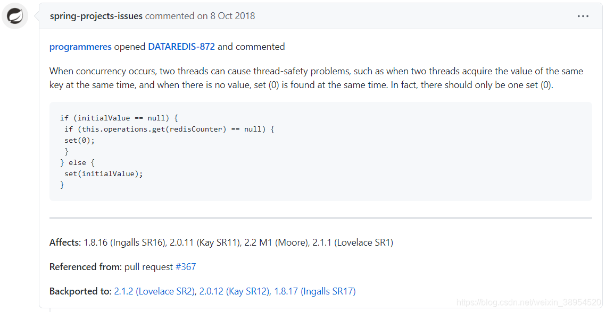

# 问题分析

近期公司的订单编号出现重复编号，并且每次都是前几个编号重复，后面就不会出现，从现象猜测八成是竞态条件下出现并发问题。

幸运的是我竟然能在本地重现，启动100个线程并发创建自增id，确实是会有编号0，1，2重复的情况。查看核心代码：

`生成分布式唯一自增id`.

```java
	/**
	* @Title: generate
	* @Description: 生成分布式唯一自增id.
	* @param key
	* @return
	*/
	public long generate(String key) {
		RedisAtomicLong counter = new RedisAtomicLong(key, redisTemplate.getConnectionFactory());
		return counter.getAndIncrement();
	}
```

看到这里非常奇怪，RedisAtomicLong的getAndIncrement使用的是redis的incrBy命令，这个命令是原子性的，不可能出现并发问题。

```java
    public Long increment(K key, long delta) {
        byte[] rawKey = this.rawKey(key);
        return (Long)this.execute((connection) -> {
            return connection.incrBy(rawKey, delta);
        }, true);
    }
```

那就继续查看RedisAtomicLong的初始化方法，发现问题所在：每次初始化的时候，判断Redis中是否存在redisCounter这个key，如果不存在则设置这个key为0，这两步不是原子性的，导致并发场景下，可能会有线程将已经增长的编号重新设置为0，从而导致id重复。

```java
private RedisAtomicLong(String redisCounter, RedisConnectionFactory factory, Long initialValue) {
        Assert.hasText(redisCounter, "a valid counter name is required");
        Assert.notNull(factory, "a valid factory is required");
        RedisTemplate<String, Long> redisTemplate = new RedisTemplate();
        redisTemplate.setKeySerializer(new StringRedisSerializer());
        redisTemplate.setValueSerializer(new GenericToStringSerializer(Long.class));
        redisTemplate.setExposeConnection(true);
        redisTemplate.setConnectionFactory(factory);
        redisTemplate.afterPropertiesSet();
        this.key = redisCounter;
        this.generalOps = redisTemplate;
        this.operations = this.generalOps.opsForValue();
        if (initialValue == null) {
        	//判断Redis中是否存在redisCounter这个key，如果不存在则设置这个key为0
            if (this.operations.get(redisCounter) == null) {
                this.set(0L);
            }
        } else {
            this.set(initialValue.longValue());
        }

    }
```

# 解决方案

## 1.升级spring-data-redis版本

目前官方已经修复了这个问题，受影响的版本: 1.8.16 , 2.0.11, 2.2 , 2.1.1 前的版本，2.1.2 , 2.0.12, 1.8.17 之后的版本已经修复。



## 2.业务代码加锁

判断Redis中是否存在redisCounter这个key，如果不存在则加上Redis分布式锁，防止并发创建。这个锁竞争只会在刚开始的时候出现，所有对性能影响不大。

伪代码：

```javascript
	/**
	* @Title: generate
	* @Description: 生成分布式唯一自增id.
	* @param key
	* @return
	*/
	public long generate(String key) {
        RedisAtomicLong counter=null;
        if (!exisit(key)){
            try {
            	//Redis分布式锁，注意防止超时导致死锁
                lock(key+"_lock");
                counter = new RedisAtomicLong(key, redisTemplate.getConnectionFactory());
            } finally {
                unLock(key+"_lock");
            }
        }else {
            counter = new RedisAtomicLong(key, redisTemplate.getConnectionFactory());
        }
        return counter.getAndIncrement();

    }
```

[def]: ../../
